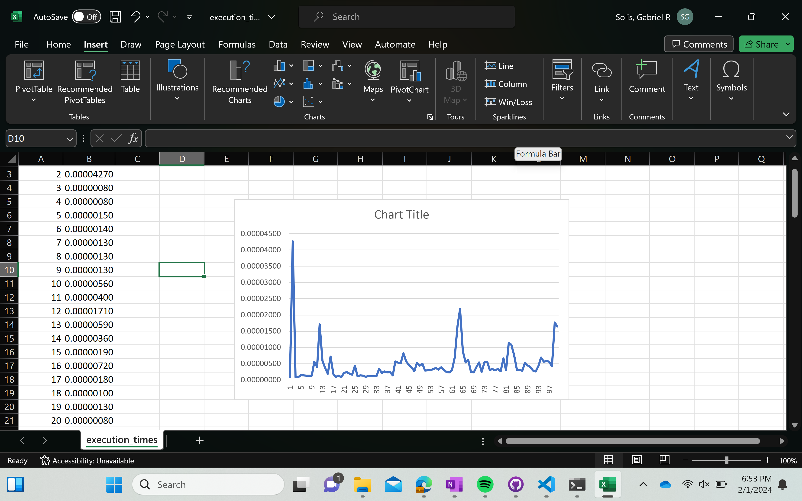

# Python-Refresher

## Python Programming Basics

With the echo function I noticed that there was a corner case with inputs less then 3 characters long. So, I implemented a way that would work for any input.

## Python Decorator Implementation

The overall pattern of my graph is trending at a linear rate with the exception of outliers. 

For the timer decorator function, I used what was in one of the pdf files on icon. As for the fib function, I created a the function using dynamic programming but then realized that I should use an iterative approach instead because that is what I assumed to be the expected way. I figured that the dynamic programming way wouldn't result the in the correct data.
